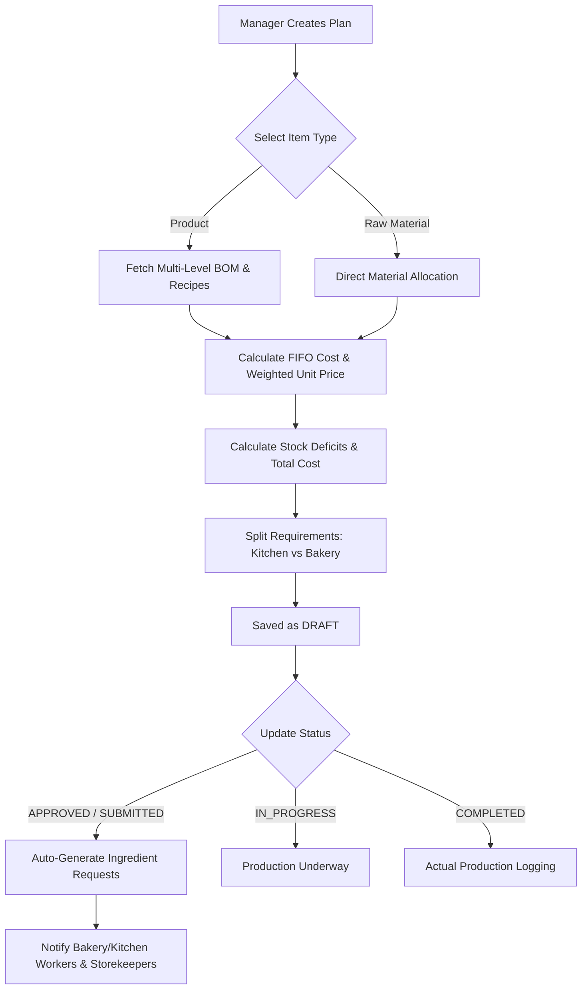

# Production Planning Tab - Complete Functional & Technical User Guide
## Bakery Outlet Management System (BMS) - Manager Module

---

## 1. Overview & Purpose of Production Planning

The **Production Planning** tab is the primary operational module for production managers. It empowers managers to forecast, create, calculate, and schedule daily or weekly production batches for bakery items (e.g., breads, pastries, cakes) and raw materials.

### Primary Goals
1. **Demand & Yield Planning**: Define quantities for products or raw materials to be produced/prepared.
2. **Automated Recipe / BOM Scaling**: Automatically expand multi-level Bill of Materials (BOM) to compute raw material requirements.
3. **Inventory Deficit Detection**: Calculate stock deficits against current warehouse stock before baking begins.
4. **FIFO Costing**: Dynamically estimate raw material and product costs using First-In-First-Out batch pricing.
5. **Kitchen & Bakery Work Allocation**: Route material requirements to respective production centers (Kitchen vs. Bakery).
6. **Automated Storekeeper Ingredient Requests**: Instantly generate ingredient issue requests for storekeepers upon plan approval.
7. **Outlet Pre-Distribution**: Optionally allocate produced items to specific retail outlets right inside the plan.

---

## 2. Core Features & Capabilities



### Key Technical Features

1. **Multi-Item Type Support**:
   - **`product`**: Standard bakery products linked to recipes/BOMs.
   - **`raw_material`**: Direct raw materials needed for standalone prep.

2. **Recursive Multi-Level BOM Expansion**:
   - Handles parent products containing child semi-finished products and ingredients without circular dependency loops or double-counting.

3. **First-In-First-Out (FIFO) Cost Estimation**:
   - Inspects active stock batches ordered by creation date to calculate true material costs.
   - Computes weighted unit cost: `weightedUnitCost = totalCost / requiredQuantity`.

4. **Stock Deficit Calculation**:
   - Groups stock by generic material names or material codes.
   - Formula: `stockDeficit = max(0, requiredQuantity - totalAvailableStock)`.

5. **Kitchen vs. Bakery Center Routing**:
   - Automatically categorizes raw material demands into:
     - `rawMaterialQuantityForKitchen`
     - `rawMaterialQuantityForBakery`

6. **Automated Ingredient Request Generation**:
   - When status changes to `APPROVED` or `SUBMITTED`, system auto-creates `IngredientRequest` records assigned to storekeepers for fulfillment.

7. **Template Management**:
   - Mark any production plan as a **Template** (`isTemplate = true`) to reuse standard daily production plans.

8. **Safety Deletion Policy**:
   - **Strict Rule**: Only plans in `DRAFT` status or `isTemplate = true` can be deleted. Plans in `APPROVED`, `IN_PROGRESS`, or `COMPLETED` are protected from deletion to safeguard kitchen audit trails.

---

## 3. Production Plan Lifecycle & Status Flow

| Status | Code | Description & Triggered Actions |
| :--- | :--- | :--- |
| **Draft** | `DRAFT` | Initial creation state. Full edit and delete permissions allowed. |
| **Approved / Submitted** | `APPROVED` | Approved by Manager. **Triggers auto-creation of `IngredientRequest`** for storekeeper and sends worker notifications. Cannot be deleted. |
| **In Progress** | `IN_PROGRESS` | Kitchen/Bakery floor has commenced baking/preparation. |
| **Completed** | `COMPLETED` | Production finished; batch items passed to Actual Production and Outlet Distribution. |
| **Cancelled** | `CANCELLED` | Production plan halted before execution. |

---

## 4. Step-by-Step UI & Operational Workflows

### 4.1. Creating a New Production Plan

1. Navigate to the **Production Planning** tab in the Manager Dashboard sidebar.
2. Click the **+ Create Production Plan** button.
3. Fill in the **Plan Header**:
   - **Plan Name** *(Required)*: e.g., `Morning Production - 2026-07-28`
   - **Department**: e.g., `Main Bakery` or `Pastry Kitchen`
   - **Plan Date & Time** *(Required)*: Target production date.
   - **Notes**: Operational instructions for head bakers/chefs.
   - **Save as Template**: Toggle `Yes` if this plan will be reused daily.
4. Add **Production Items**:
   - Select **Item Type**: `Product` or `Raw Material`.
   - Search & select **Product / Material Name**.
   - Enter **Planned Quantity** (must be $\ge 1$).
   - (Optional) Select specific **Production Center** (e.g., Main Kitchen, Pastry Bakery).
   - (Optional) Add **Outlet Allocations**: Assign quantities to specific retail outlets with target dates.
5. Click **Save Plan**.

---

### 4.2. Reviewing BOM Raw Material Requirements & Stock Deficits

1. Click on any created Production Plan card/row to open details.
2. Navigate to the **Raw Material Requirements** tab/section.
3. Review the calculated metrics table:
   - **Material Name & Code**
   - **Required Quantity & Unit of Measure**
   - **Unit Cost & Total Estimated Cost**
   - **Available Stock** in warehouse
   - **Stock Deficit** *(Highlighted in RED if deficit > 0)*
4. If deficits exist:
   - Inform Storekeeper to place a Purchase Order **OR**
   - Reduce production item quantities to match available stock.

---

### 4.3. Approving a Production Plan for Floor Execution

1. Once material availability is confirmed, click **Approve Plan** (or set status to `APPROVED`).
2. The system executes the following automatically:
   - Changes status to `APPROVED`.
   - Generates **Ingredient Requests** for storekeepers.
   - Sends real-time notifications to **Bakery Workers** (Role 12) and **Kitchen Workers** (Role 13).
   - Locks the plan against accidental deletion.

---

### 4.4. Viewing Kitchen vs. Bakery Material Breakdowns

Managers can view isolated ingredient lists for kitchen vs bakery teams:
- **Kitchen Material Sheet**: Displays ingredients assigned to kitchen centers (e.g., sauces, gravies, cooked fillings).
- **Bakery Material Sheet**: Displays ingredients assigned to bakery centers (e.g., flour, yeast, butter, sugar).

---

### 4.5. Managing Templates & Routine Plans

1. Click **Filter by Templates** in the Production Planning tab.
2. Select an existing template (e.g., `Standard Daily Morning Bread`).
3. Click **Use Template** to populate a new production plan prepopulated with standard products and quantities.
4. Modify date and quantities as required, then save.

---

## 5. API Data Structures & Endpoints

### 5.1. Create Production Plan API
`POST /api/manager/production-plan`

#### Request Payload Example:
```json
{
  "planName": "Daily Morning Production",
  "department": "Main Bakery",
  "planDate": "2026-07-28T06:00:00+05:30",
  "notes": "Expected surge in sandwich bread demand",
  "status": "DRAFT",
  "isTemplate": false,
  "productionItems": [
    {
      "type": "product",
      "productId": 1,
      "productName": "White Bread 400g",
      "quantity": 200,
      "productionCenterId": 1,
      "outlets": [
        {
          "outletId": 2,
          "outletName": "Nugegoda Outlet",
          "quantity": 100,
          "date": "2026-07-28"
        },
        {
          "outletId": 3,
          "outletName": "Maharagama Outlet",
          "quantity": 100,
          "date": "2026-07-28"
        }
      ]
    },
    {
      "type": "raw_material",
      "rawMaterialId": 5,
      "productName": "Premix Cake Flour",
      "quantity": 25,
      "productionCenterId": 2
    }
  ]
}
```

---

### 5.2. Update Production Plan Status API
`PUT /api/manager/production-plan/{planId}/status?status=APPROVED`

---

### 5.3. Fetch Raw Material Requirements API
`GET /api/manager/production-plan/{planId}/raw-materials`

#### Response Example:
```json
[
  {
    "rawMaterialId": 10,
    "rawMaterialName": "Wheat Flour (Grade A)",
    "materialCode": "RM-FLOUR-01",
    "requiredQuantity": 50.00,
    "unitOfMeasure": "kg",
    "unitCost": 220.00,
    "totalCost": 11000.00,
    "availableStock": 120.00,
    "stockDeficit": 0.00,
    "productionCenterId": 1,
    "productionCenterName": "Main Bakery Center"
  },
  {
    "rawMaterialId": 12,
    "rawMaterialName": "Margarine / Butter",
    "materialCode": "RM-BUTTER-02",
    "requiredQuantity": 15.00,
    "unitOfMeasure": "kg",
    "unitCost": 850.00,
    "totalCost": 12750.00,
    "availableStock": 10.00,
    "stockDeficit": 5.00,
    "productionCenterId": 1,
    "productionCenterName": "Main Bakery Center"
  }
]
```

---

### 5.4. Full API Endpoint Matrix

| Method | Endpoint | Description |
| :--- | :--- | :--- |
| `POST` | `/api/manager/production-plan` | Create new production plan (with optional outlet allocations) |
| `GET` | `/api/manager/production-plans` | List all production plans (ordered newest first) |
| `GET` | `/api/manager/production-plan/{planId}` | Get detailed plan info with BOM calculations |
| `PUT` | `/api/manager/production-plan/{planId}` | Full update of existing production plan |
| `PUT` | `/api/manager/production-plan/{planId}/status` | Update plan status (`DRAFT`, `APPROVED`, etc.) |
| `DELETE`| `/api/manager/production-plan/{planId}` | Delete plan (Restricted to `DRAFT` or `isTemplate = true`) |
| `GET` | `/api/manager/production-plan/templates` | Fetch all production plan templates |
| `GET` | `/api/manager/production-plan/{planId}/raw-materials` | Calculate BOM required raw materials & deficits |
| `GET` | `/api/manager/production-plan/{planId}/raw-material-cost` | Calculate total raw material cost |
| `GET` | `/api/manager/production-plan/{planId}/materials/kitchen` | Get kitchen-specific ingredient breakdown |
| `GET` | `/api/manager/production-plan/{planId}/materials/bakery` | Get bakery-specific ingredient breakdown |

---

## 6. Business Logic Rules & FAQs

> [!IMPORTANT]
> **Q: How does the system calculate ingredient costs when multiple stock batches exist?**
> A: The system uses **First-In-First-Out (FIFO)** batch pricing. It consumes oldest stock batches first until required quantity is satisfied, resulting in exact batch-based weighted unit cost calculation.

> [!WARNING]
> **Q: Can I delete an APPROVED production plan?**
> A: No. Once a plan is marked `APPROVED`, `IN_PROGRESS`, or `COMPLETED`, deletion is blocked to maintain data integrity with generated ingredient requests and storekeeper inventory logs.

> [!NOTE]
> **Q: What happens when an Outlet Allocation is included in a Production Plan?**
> A: The backend automatically creates coupled **Distribution Plans** (`DistributionPlan`) for each target outlet and date with status set to `NOT_RECEIVED`, ready for dispatch when production finishes.

---
*Production Planning Documentation | Version 1.0.0 | BMS Backend Manager Module*
