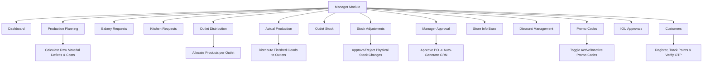

# Bakery Outlet Management System (BMS)
## Manager Module - User Manual & Operating Guide

---

## 1. Executive Summary & Overview

Welcome to the **Manager Module User Manual** for the Bakery Outlet Management System (BMS). The Manager Module serves as the centralized operational hub for production planning, raw material recipe scaling, inventory oversight, storekeeper approval workflows, outlet distribution, and customer relationship management.

---

## 2. Navigation & Module Tabs Structure

Below is the complete list of navigation tabs available in the **Manager Module** sidebar menu:

1. 🎛️ **Dashboard** — Overview of key metrics, alerts, and high-level production/sales summary.
2. 📅 **Production Planning** — Create, edit, and manage production plans, calculate raw material requirements (BOM), and track plan status.
3. 🏭 **Bakery Requests** — View and manage raw material allocation requests specific to the Bakery production center.
4. 👨‍🍳 **Kitchen Requests** — View and manage raw material allocation requests specific to the Main Kitchen production center.
5. 🚛 **Outlet Distribution** — Plan, dispatch, and manage distribution schedules of finished products to retail outlets.
6. 🏬 **Actual Production** — Log actual produced batches, manage finished goods inventory, and distribute stock to outlets.
7. 🏪 **Outlet Stock** — Monitor real-time finished product stock levels across all retail outlets and request inter-outlet transfers.
8. 📋 **Stock Adjustments** — Review and approve/reject inventory variance adjustments submitted by storekeepers and kitchen staff.
9. 👤 **Manager Approval** — Review and approve/reject Purchase Orders (POs) generated by storekeepers (triggers automatic GRN creation upon approval).
10. 🏬 **Store Info Base** — Access master product catalog, raw material master, production centers, and mini-store availability.
11. 🏷️ **Discount Management** — Configure and manage discounts across product categories and retail channels.
12. 🏷️ **Promo Codes** — View marketing promotional campaigns and toggle active/inactive status for checkout promo codes.
13. 📄 **IOU Approvals** — Review and approve/reject IOU (I Owe You) petty cash and material issuance requests.
14. 👥 **Customers** — Lookup customer profiles, register new loyalty members, view points history, and verify customer numbers via OTP.

---

## 3. Manager Module Architecture & Workflow Diagram

---

## 4. Detailed Tab Operating Procedures (SOPs)

### 4.1. Dashboard
- **Purpose**: Displays real-time operational summaries, production metrics, low stock warnings, pending manager approvals, and quick navigation shortcuts.

### 4.2. Production Planning & BOM Scaling
- **Purpose**: Build daily or weekly production schedules. Based on configured **Recipes**, the system automatically calculates required raw materials, flags stock deficits, and estimates total production costs.
- **Key Actions**:
  - **Create Plan**: `POST /api/manager/production-plan`
  - **Update Status**: `PUT /api/manager/production-plan/{planId}/status` (`DRAFT`, `APPROVED`, `IN_PROGRESS`, `COMPLETED`, `CANCELLED`)
  - **Inspect Raw Materials**: `GET /api/manager/production-plan/{planId}/raw-materials`

### 4.3. Bakery Requests & 4.4. Kitchen Requests
- **Purpose**: Separate ingredient and raw material request lists tailored specifically for the Bakery floor and Main Kitchen floor.
- **Endpoints**:
  - **Kitchen Materials**: `GET /api/manager/production-plan/{planId}/materials/kitchen`
  - **Bakery Materials**: `GET /api/manager/production-plan/{planId}/materials/bakery`

### 4.5. Outlet Distribution
- **Purpose**: Create and track distribution plans for delivering finished goods to retail outlets.
- **Endpoints**:
  - **List Plans**: `GET /api/manager/distribution/plans`
  - **Create Plan**: `POST /api/manager/distribution/plans`
  - **Update / Delete**: `PUT` & `DELETE` `/api/manager/distribution/plans/{dpId}`

### 4.6. Actual Production
- **Purpose**: Log actual produced quantities from bakery/kitchen batches and distribute finished goods directly to outlets.
- **Endpoint**: `POST /api/v1/manager/actual-production/distribute`

### 4.7. Outlet Stock
- **Purpose**: View live stock levels at any retail outlet and initiate inter-outlet inventory transfer requests.
- **Endpoints**:
  - **View Stock**: `GET /api/v1/manager/actual-production/outlet-stock?outletId={id}`
  - **Transfer Request**: `POST /api/v1/manager/actual-production/outlet-transfer`

### 4.8. Stock Adjustments
- **Purpose**: Review variance reports (due to spillage, damage, or audit count changes) submitted by storekeepers.
- **Action**: Approve or Reject adjustment requests. Approving automatically updates master physical inventory.
- **Endpoint**: `PUT /api/manager/stock-adjustments/approval`

### 4.9. Manager Approval
- **Purpose**: Review pending Purchase Orders (POs) generated by storekeepers.
- **Action**: Approving a PO automatically generates a Goods Received Note (GRN) draft for the storekeeper.
- **Endpoint**: `PUT /api/manager/purchase-orders/{poId}/approve`

### 4.10. Store Info Base
- **Purpose**: Master inventory and product repository. Lists products, raw materials, production centers, and mini-store availability.
- **Endpoint**: `GET /api/manager/products`

### 4.11. Discount Management & 4.12. Promo Codes
- **Purpose**: Manage store discounts and marketing promo codes. Toggle promo code status between active and inactive.
- **Endpoints**:
  - **List Promotions**: `GET /api/manager/promotions/all`
  - **Toggle Promo**: `PATCH /api/manager/promotions/toggle/{id}`

### 4.13. IOU Approvals
- **Purpose**: Review and approve/reject IOU requests for temporary cash/material issuances submitted by storekeepers and supervisors.

### 4.14. Customers
- **Purpose**: Customer loyalty management, profile registration, points history, and OTP verification.
- **Endpoints**:
  - **Lookup**: `GET /api/pos/v1/customers/lookup?phone={phone}`
  - **Register**: `POST /api/pos/v1/customers/register`
  - **Points History**: `GET /api/pos/v1/customers/{id}/points-history`
  - **OTP Verification**: `POST /api/pos/v1/customers/send-otp` & `/verify-otp`

---

## 5. API Quick Reference Matrix

| Navigation Tab | HTTP Method | API Endpoint | Primary Action |
| :--- | :--- | :--- | :--- |
| **Production Planning** | `POST` | `/api/manager/production-plan` | Create plan with BOM scaling |
| **Production Planning** | `GET` | `/api/manager/production-plans` | Fetch all production plans |
| **Production Planning** | `PUT` | `/api/manager/production-plan/{id}/status` | Update plan status |
| **Bakery Requests** | `GET` | `/api/manager/production-plan/{id}/materials/bakery` | View bakery ingredient requirements |
| **Kitchen Requests** | `GET` | `/api/manager/production-plan/{id}/materials/kitchen` | View kitchen ingredient requirements |
| **Outlet Distribution** | `GET` | `/api/manager/distribution/plans` | Fetch all outlet distribution plans |
| **Outlet Distribution** | `POST` | `/api/manager/distribution/plans` | Create distribution plan |
| **Actual Production** | `GET` | `/api/v1/manager/actual-production` | Get actual production logs |
| **Actual Production** | `POST` | `/api/v1/manager/actual-production/distribute` | Distribute finished goods to outlet |
| **Outlet Stock** | `GET` | `/api/v1/manager/actual-production/outlet-stock` | View real-time outlet inventory |
| **Stock Adjustments** | `PUT` | `/api/manager/stock-adjustments/approval` | Approve/Reject stock adjustment |
| **Manager Approval** | `PUT` | `/api/manager/purchase-orders/{poId}/approve` | Approve PO & trigger GRN |
| **Store Info Base** | `GET` | `/api/manager/products` | Master product & raw material catalog |
| **Promo Codes** | `GET` | `/api/manager/promotions/all` | Fetch promo codes |
| **Promo Codes** | `PATCH`| `/api/manager/promotions/toggle/{id}` | Toggle promo active status |
| **Customers** | `GET` | `/api/pos/v1/customers/lookup` | Lookup customer profile by phone |
| **Customers** | `POST` | `/api/pos/v1/customers/register` | Register new customer |

---

*Manual Version: 1.1.0 | Bakery Management System (BMS) | Last Updated: July 2026*
